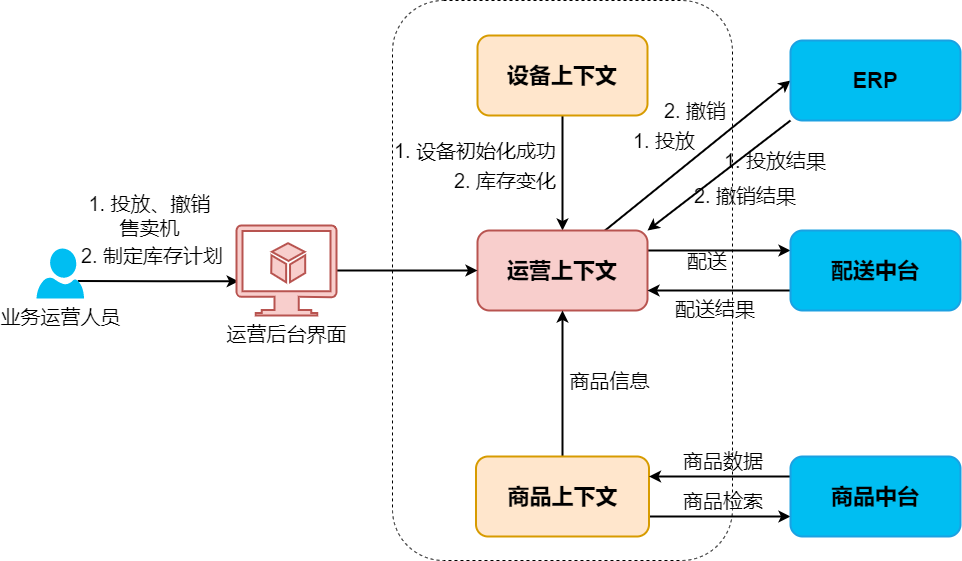
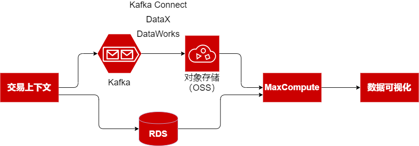

# “运营域”整体架构设计

## 上下文交互图

使用上分析方法，我们可以得到运营域的上下文交互图：

作为核心上下文，运营上下文为零售企业的业务运营人员提供运营解决方案，解决售卖机的合理投放、撤销，以及库存计划的指定和执行问题，设备上下文、商品上下文，以及客户内部的ERP上下文、配送上下文，为运营上下文提供支撑，分别解决设备的管理和操控、商品信息的获取、售卖机设备的采购和安装、商品的配送等问题。

## 数据处理和分析

在多数系统中，数据分析是不可或缺的部分。系统上线后，在为用户提供服务的同时，会积累下来大量行为数据，这些行为数据是重要的生产原料，经过处理加工和分析之后，会成为运营决策的重要依据。smartrm系统中，数据的处理通路如下图所示：

