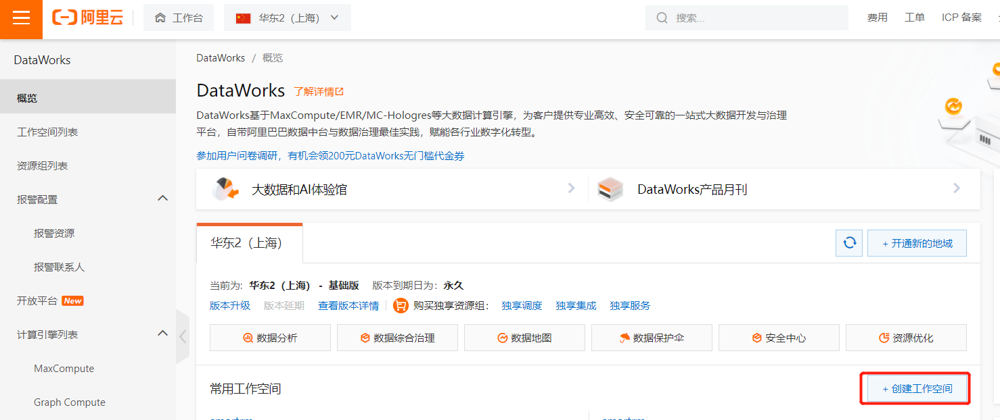
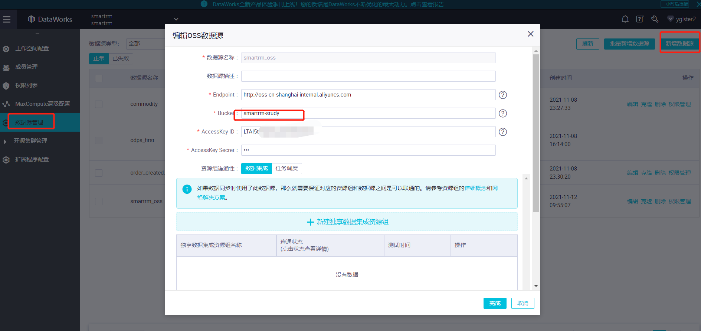
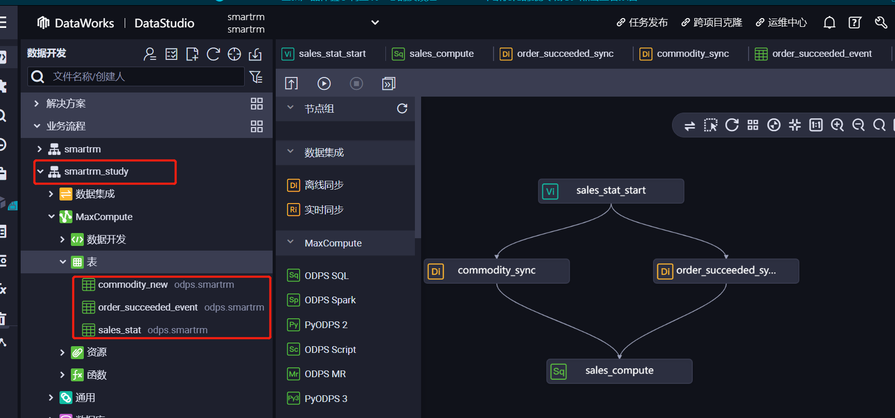

# 经营数据分析服务在阿里云上的搭建

## 一. 模拟数据生成

使用压测框架locust生成模拟数据

**1. 安装locust**

```shell
 pip3 install locust
```

**2. 编写压测脚本**

压测脚本使用python编写

```python
from locust import HttpUser, TaskSet, task
import json
import random


class Robot(TaskSet):

    #售卖机id列表，需要提前导入数据到数据库
    machines = [1, 12, 13, 14, 15, 16, 17, 18, 19, 20]

    def buy(self, machineId, commodityId):
        response = self.client.post('/trade/slot/select', json={"platformType":"Wechat", "machineId":machineId, "commodityId":commodityId})
        if response.ok:
            result = json.loads(response.text)
            if result['code'] == 0:
                s = result['data']['codeUrl']
                s1 = s[s.find('orderId:')+len('orderId:'):]
                orderId = s1[:s1.find(';')]
                self.client.post('/mock/payment/pay/'+orderId)

    def chooseMachine(self):
        return Robot.machines[random.randint(0,9)]

    def releaseMachine(self, machineId):
        pass


    @task(100)
    def buy1000001(self):
        machineId = self.chooseMachine()
        self.buy(machineId, '1000001')
        self.releaseMachine(machineId)

    @task(90)
    def buy1000002(self):
        machineId = self.chooseMachine()
        self.buy(machineId, '1000002')
        self.releaseMachine(machineId)

    @task(80)
    def buy1000003(self):
        machineId = self.chooseMachine()
        self.buy(machineId, '1000003')
        self.releaseMachine(machineId)


    @task(70)
    def buy1000004(self):
        machineId = self.chooseMachine()
        self.buy(machineId, '1000004')
        self.releaseMachine(machineId)

    @task(60)
    def buy1000005(self):
        machineId = self.chooseMachine()
        self.buy(machineId, '1000005')
        self.releaseMachine(machineId)

    @task(50)
    def buy1000006(self):
        machineId = self.chooseMachine()
        self.buy(machineId, '1000006')
        self.releaseMachine(machineId)

    @task(40)
    def buy1000007(self):
        machineId = self.chooseMachine()
        self.buy(machineId, '1000007')
        self.releaseMachine(machineId)

    @task(30)
    def buy1000008(self):
        machineId = self.chooseMachine()
        self.buy(machineId, '1000008')
        self.releaseMachine(machineId)

    @task(20)
    def buy1000009(self):
        machineId = self.chooseMachine()
        self.buy(machineId, '1000009')
        self.releaseMachine(machineId)

    @task(10)
    def buy1000010(self):
        machineId = self.chooseMachine()
        self.buy(machineId, '1000010')
        self.releaseMachine(machineId)

class Test(HttpUser):
    tasks = [Robot]
    host = "http://localhost:10081"


```

**3. 启动压测**

```shell
locust -f smartrm_stress.py --logfile=locust.log
```


## 二. 数据导入对象存储

**1. 挂载对象存储**

在阿里云对象存储控制台，创建存储桶smartrm-study，具体参考文档：

```url
https://help.aliyun.com/document_detail/31885.htm
```

将对象存储的桶挂载到云主机本地目录/mnt/ossfs，请参考文档：

```
https://developer.aliyun.com/article/319233
```

**2. 上传商品数据到存储桶**

把商品数据文件commodity_new.json上传到存储桶中commodity目录。

**3. 使用kafka connect把kafka中事件数据导入到oss**

1) 进入本地kafka目录，修改配置

配置1: config/connect-standalone.properties

```
bootstrap.servers=localhost:9092

# The converters specify the format of data in Kafka and how to translate it into Connect data. Every Connect user will
# need to configure these based on the format they want their data in when loaded from or stored into Kafka
key.converter=org.apache.kafka.connect.storage.StringConverter
value.converter=org.apache.kafka.connect.storage.StringConverter
# key.converter=org.apache.kafka.connect.json.JsonConverter
# value.converter=org.apache.kafka.connect.json.JsonConverter
# Converter-specific settings can be passed in by prefixing the Converter's setting with the converter we want to apply
# it to
key.converter.schemas.enable=true
value.converter.schemas.enable=true

offset.storage.file.filename=/tmp/connect.offsets
# Flush much faster than normal, which is useful for testing/debugging
offset.flush.interval.ms=10000

# Set to a list of filesystem paths separated by commas (,) to enable class loading isolation for plugins
# (connectors, converters, transformations). The list should consist of top level directories that include
# any combination of:
# a) directories immediately containing jars with plugins and their dependencies
# b) uber-jars with plugins and their dependencies
# c) directories immediately containing the package directory structure of classes of plugins and their dependencies
# Note: symlinks will be followed to discover dependencies or plugins.
# Examples:
# plugin.path=/usr/local/share/java,/usr/local/share/kafka/plugins,/opt/connectors,
#plugin.path=

consumer.group.id=smartrm1
```

配置2：config/connect-file-sink.properties

```
name=local-file-sink
connector.class=FileStreamSink
tasks.max=1
file=/mnt/ossfs/event/OrderSucceededEvent/20211111data
topics=trade.OrderSucceededEvent

```

2) 启动kafka connect

```shell
bin/connect-standalone.sh config/connect-standalone.properties config/connect-file-sink.properties
```

**<u>实际应用中，oss中数据文件需要按天滚动，因此导数据进程也需要定时切换，具体可以借助crontab, 如果数据量大，需要分布式执行kafka connect，可以借助k8s执行调度。</u>**


## 三. 数据集成和计算

### 3.1 使用Dataworks集成oss中数据

**1）创建工作空间**



**2）创建数据源**

进入到工作空间的“数据集成”服务，创建oss数据源：



**3）创建数据表：**

进入Dataworks中“DataStudio”，新建业务流程smartrm_study，在smartrm_study业务流程中新建MaxCompute表：



commodity_new表：

```sql
CREATE TABLE IF NOT EXISTS commodity_new
(
    jsondata STRING
) ;
```

order_succeeded_event表：

```sql
CREATE TABLE IF NOT EXISTS order_succeeded_event
(
    json STRING
) 
PARTITIONED BY
(
    dt   STRING
)
LIFECYCLE 90;
```

sales_stat表：

```sql
CREATE TABLE IF NOT EXISTS sales_stat
(
    machineid           BIGINT        ,
    commodityid         STRING        ,
    commodityname       STRING        ,
    firstlevelcategory  STRING        ,
    secondlevelcategory STRING        ,
    thirdlevelcategory  STRING        ,
    label               STRING        ,
    num                 BIGINT        ,
    amount              DECIMAL(38,18)
) 
PARTITIONED BY
(
    dt                  STRING        
)
LIFECYCLE 90;
```

**4）创建数据同步节点**

进入smartrm_study数据流编辑页面（双击smartrm_study业务流程），创建commodity_sync，order_succeeded_sync同步节点，把oss中的数据同步到MaxCompute表。

### 3.2 使用MaxCompute统计销售数据

在smartrm_study业务流程编辑页面创建ODPS SQL节点，编写sql统计脚本如下：

```sql
INSERT OVERWRITE TABLE sales_stat PARTITION(dt='${var}')
SELECT  s.machineId
        ,c.commodityId
        ,c.commodityName
        ,c.firstLevelCategory
        ,c.secondLevelCategory
        ,c.thirdLevelCategory
        ,c.LABEL
        ,s.cnt
        ,s.amount
FROM    (
            SELECT  GET_JSON_OBJECT(jsondata, '$.commodityId') AS commodityId
                    ,GET_JSON_OBJECT(jsondata, '$.commodityName') AS commodityName
                    ,GET_JSON_OBJECT(jsondata, '$.firstLevelCategory') AS firstLevelCategory
                    ,GET_JSON_OBJECT(jsondata, '$.secondLevelCategory') AS secondLevelCategory
                    ,GET_JSON_OBJECT(jsondata, '$.thirdLevelCategory') AS thirdLevelCategory
                    ,GET_JSON_OBJECT(jsondata, '$.label') AS LABEL
            FROM    commodity_new
        ) c
JOIN    (
            SELECT  cast(GET_JSON_OBJECT(json, '$.machineId') as bigint) AS machineId
                    ,GET_JSON_OBJECT(json, '$.commodities[0].commodityId') AS commodityId
                    ,COUNT(1) AS cnt
                    ,SUM(GET_JSON_OBJECT(json, '$.totalAmount')) AS amount
            FROM    order_succeeded_event
            WHERE   dt = '${var}'
            GROUP BY GET_JSON_OBJECT(json, '$.machineId')
                     ,GET_JSON_OBJECT(json, '$.commodities[0].commodityId')
        ) s
ON      c.commodityId = s.commodityId
;
```

### 3.3 配置调度

在smartrm_study业务流程编辑界面，新建虚拟节点sales_stat_start，建立业务流程中各节点关系，配置sales_stat_start调度方式。


## 四. 数据可视化

打开阿里云Quick BI控制台，地址如下：

```url
https://bi.aliyun.com/workspace/dashboard
```
根据如下流程操作：

1）创建数据源

2）创建数据集

3）创建仪表板

4）拖拽编辑仪表板，生成报表

