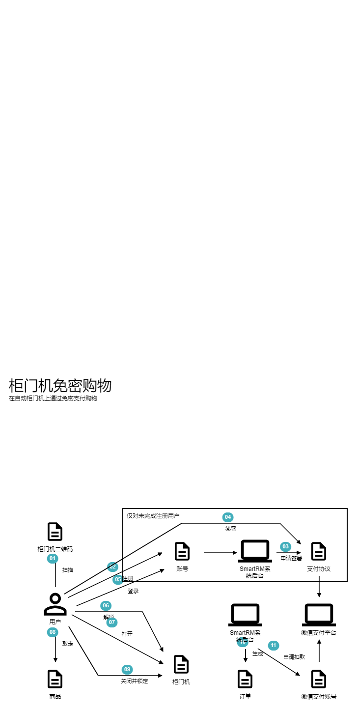

# SmartRM系统整体战略设计

## 1. 用户故事

### 1.1 什么是用户故事及如何描述

在软件开发中，用户故事是一种对软件系统特性的非正式的自然语言描述，是敏捷软件开发中从终端用户的角度对软件系统特性进行捕捉的一种方式。用户故事描述了不同类型的用户需要什么以及为什么需要，它可以帮助我们创建需求的简单描述。

*<u>在软件开发和演进过程中，随着产品和开发对产品认识的加深，需求总是在不断变化，所以，过早地进入需求细节以及对细节的描述，是一种时间上的巨大浪费。从这一点来说，用户故事提供了一种恰到好处的粒度，使得产品在需求分析阶段能够极大地节约时间，并且使产品和研发人员始终把注意力集中在关键点，避免他们过早地陷入细节以及被细节所局限，同时给产品功能留出了讨论空间，从而使产品有机会在讨论过程中得到优化。</u>*

用户故事的构建一般来说有三个环节：

1. 简单描述用户需求；
2. 围绕简单描述进行讨论；
3. 明确如何验证。

分别对应用户故事的三个元素，也就是3C：Card(卡片)、Conversation(谈话)、Confirmation(验证)。

#### 1.1.1 Card(卡片)

“卡片”就是指对用户故事的简述（传统上人们通过便利贴在白板上构建用户故事），一个好的用户故事卡片包括三个要素：

1. 谁：谁需要这个功能；

2. 需要什么：想通过系统完成什么事情；

3. 为什么：为什么需要这个功能，这个功能带来什么样的价值。

   

#### 1.1.2 Conversation（谈话）

谈话是指用户、领域专家、产品经理、研发之间围绕用户故事进行的讨论，谈话是明确需求细节的必要环节。可以用文字对谈话进行简要记录，此外，也可以基于图形或其他工具进行讨论。稍后我们会介绍相关工具可以对用户故事进行挖掘和细化([使用Domain Storytelling挖掘用户故事](# 2. 使用Domain Storytelling挖掘用户故事))。

#### 1.1.3 Confirmation（验证）

验证代表了验收测试，描述了客户或者产品owner怎样确定用户故事已经被实现，且能够满足需求。一般可以用如下模板写Confirmation:

```
假设我是<角色>，在xxx情况下，
当我<操作>，
那么<结果>。
```

### 1.2 使用用户故事收集和梳理SmartRM的需求

当SmartRM立项之后，我们开天辟地要做的第一件事情，就是梳理出最顶层的**用户故事**。在团队中，撰写用户故事的一般是产品经理。在SmartRM案例中，我们的产品经理梳理出来以下这些最主要的顶层**用户故事**，迈开了系统分析和建模工作的第一步，为我们的后续工作打下了基础。（所有用户故事的详细描述，都是建立通用语言的关键资料，因此，我们将其收录进[SmartRM通用语言文档](../通用语言/SmartRM通用语言文档.md)）

1. ***售卖机扫码支付购物***

   - **卡片**

     作为用户，

     我希望在售卖机上通过手机扫码支付购买商品，

     以便快速便捷地购物。

   - **谈话**

     详见[SmartRM通用语言文档](../通用语言/SmartRM通用语言文档.md)

   - **验收标准**

     假设我是一名用户，货道售卖机屏幕的商品列表上有商品A, B, C，

     当我在售卖机屏幕上选择了商品A，并扫描展示的二维码完成支付后，

     那么商品A就会从售卖机中弹出，我可以拿到商品A。

2. ***柜门机免密购物***

   - **卡片**

     作为用户，

     我希望在支持自动结算免密支付的柜门机上扫码开门后拿到商品，关门就可以结束购物，系统后台可以自动结算并且扣费，

     以便在柜门机上能更快捷地进行购物。

   - **谈话**

     详见[SmartRM通用语言文档](../通用语言/SmartRM通用语言文档.md)

   - **验收标准**

     假设我是一名用户，柜门机里有商品A, B, C

     当我打开柜门，从柜门机拿走商品A并且关闭柜门，

     那么后台会自动完成结算和支付，从用户账户扣除商品A的价格，并且锁定柜门。

其他顶层用户故事还包括：

***售卖机投放***

***售卖机撤销***

***补货***

***经营分析***

此处我们仅对用户故事的描述方法进行示例，所有用户故事的详细描述，请参见[SmartRM通用语言文档](../通用语言/SmartRM通用语言文档.md)。


## 2. 使用Domain Storytelling分析用户故事

学会一种语言的最好方式是听别人说这种语言，尝试重复他们所说的并留意他们的反馈。

### 2.1 什么是domain storytelling？

Domain Storytelling是一种领域分析建模方法，通过这种方法，产品和研发人员可以利用语言学习的相同原理建立或者学习一个领域的通用语言，并且建立领域模型。

### 2.2 domain storytelling图和相关工具

在storytelling过程中，一方（通常是架构师）聆听另一方（通常是产品经理或者领域专家）以主谓宾的句型（谁做了什么）讲述用户故事的流程，进行问答和讨论，并以图形的方式快速复述出来。


使用在线工具[domain-story-modeler](https://github.com/WPS/domain-story-modeler)，可以在线实践domain storytelling。

### 2.3 对SmartRM的用户故事进行story telling

#### 2.3.1 售卖机扫码支付购物


顶层用户故事的storytelling描述了顶层用户故事的整体框架，但是其中对部分活动的描述并不够，为了更深入的了解领域，我们对这些部分可以进一步展开，进行下一层用户故事的storytelling。例如这里我们对“用户选择商品”（图中01）、“货道售卖机弹出支付二维码”（图中02）两个子用户故事进一步进行了storytelling。

##### 2.3.1.1 用户选择商品


##### 2.3.1.2 货道售卖机弹出支付二维码


#### 2.3.2 柜门机免密购物



为了充分建立通用语言并且使我们接下来要进行的战略设计能够精准合理，我们对所有顶层用户故事以及必要的子用户故事进行了storytelling，由于domain storytelling是建立通用语言之前的重要环节，是建立通用语言的有效手段之一，因此我们也将其结果完整收录进了[SmartRM通用语言文档](../通用语言/SmartRM通用语言文档.md)，其它几个顶层用户故事（***售卖机投放***、***售卖机撤销***、***补货***、***经营分析***）及其子用户故事的storytelling结果具体请参见该文档。

## 3. 建立通用语言

我们对用户故事进行storytelling，其实就是建立领域通用语言的过程，storytelling的输出结果（上述的storytelling图）也就包含了领域通用语言的完整语句，对象、角色、活动、以及体现它们相互作用的完整语句，在图中都可以一览无余。这里我们可以更进一步，将通用语言中的词汇提炼出来，将其中英文都列在通用语言词汇表中，这些词汇将会贯穿整个建模和设计过程，最终也会体现在代码中，因此团队中所有成员，都需要明确理解其含义，并且在相关讨论、模型、以及代码中使用它们。这个表格的样例如下所示，完整表格较长，具体请参见[SmartRM通用语言文档](../通用语言/SmartRM通用语言文档.md)。

| 类型 | 中文         | 英文                    | 上下文                     |
| ---- | ------------ | ----------------------- | -------------------------- |
| 对象 | 商品         | commodity               | 用户选择商品               |
| 对象 | 支付         | payment                 | 用户完成支付               |
| 对象 | 货道售卖机   | slot vending machine | 货道售卖机展示支付二维码 |
| 对象 | 支付二维码   | payment QR code         | 货道售卖机展示支付二维码 |
| 系统 | 手机支付平台 | mobile payment platform | 用户在手机支付平台完成支付 |
| 对象 | 柜门机（无人货柜、货柜机） | cabinet vending machine | 柜门机解锁柜门           |
| 对象 | 柜门机二维码 | cabinet QR code         | 用户扫描柜门机二维码       |
| .... | ....         | ....                    | ....                 |

## 4. 领域划分

领域划分是对问题空间的划分，原则是分离关注点，目的是将系统的建模和设计工作分而治之，进行简化，并为寻找限界上下文提供依据，打下基础。

用户故事是从用户的角度对需求的描述，也就是领域问题的描述，是与实现方案无关的。我们可以借助用户故事进行领域划分。顶层用户故事能够让我们对系统有一个全局性的认识，但是并不包含太多细节，其中的每个活动，可能较复杂，也可能包含了多个子领域的信息。如果我们要深入利用用户故事进行战略和战术设计，需要将它分解成子用户故事，将用户故事中模糊的部分逐层分解，直至清晰和聚焦。

### 4.1 分解用户故事


### 4.2 基于用户故事进行领域划分

对于分解之后的用户故事，我们可以按照分离关注点的原则将其进行分类，将关注同一细分领域的用户故事分为一组，将这些用户故事形成的小组命名，即可得到各个子领域，同时根据用例之间的层次关系，也能得到各个子领域之间的关系。


## 5. 限界上下文的识别和上下文映射

### 5.1 寻找限界上下文

通过分别从各子领域的用户故事中提取关键概念，审视它们之间的关系，以及它们与外部系统之间的关系，我们可以梳理出系统中的限界上下文。如下图所示：


融合了领域划分和限界上下文的全局系统概览如下图所示：


### 5.2 上下文映射

确定上下文之间的关系，绘制上下文映射图，是战略设计中非常重要的一步。

#### 5.2.1 SmartRM上下文映射

通过明确SmartRM之间的关系，决定应用到上下文之间的协作模式，并且在必要的地方引入防腐层(ACL)。我们得到下面的上下文映射图：


## 参考文献：

[What is User Story? (visual-paradigm.com)](https://www.visual-paradigm.com/guide/agile-software-development/what-is-user-story/)

[User Stories | Examples and Template | Atlassian](https://www.atlassian.com/agile/project-management/user-stories)

[Domain Storytelling](https://domainstorytelling.org/)

