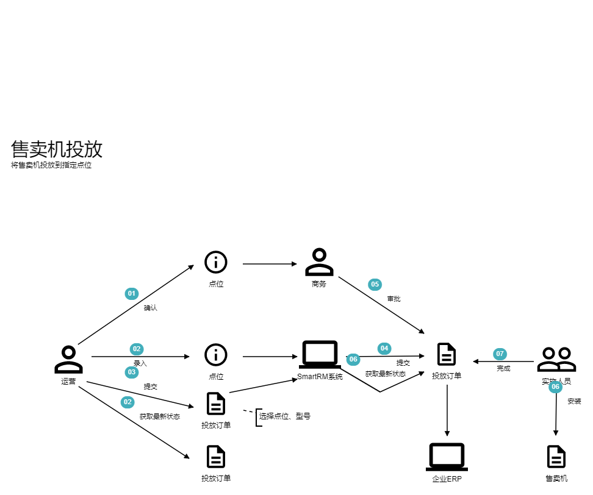
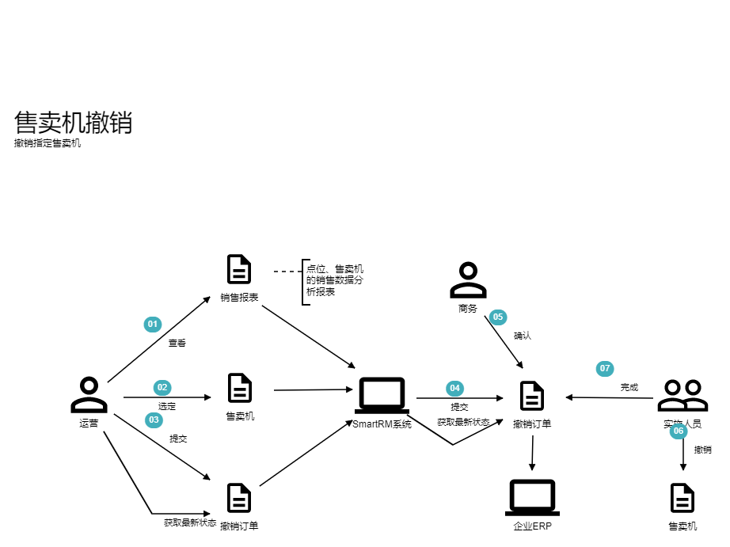
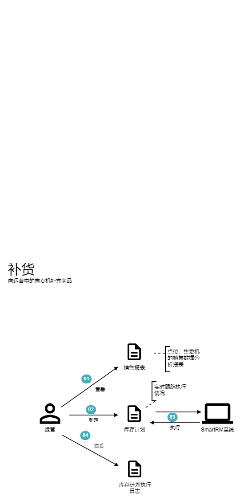
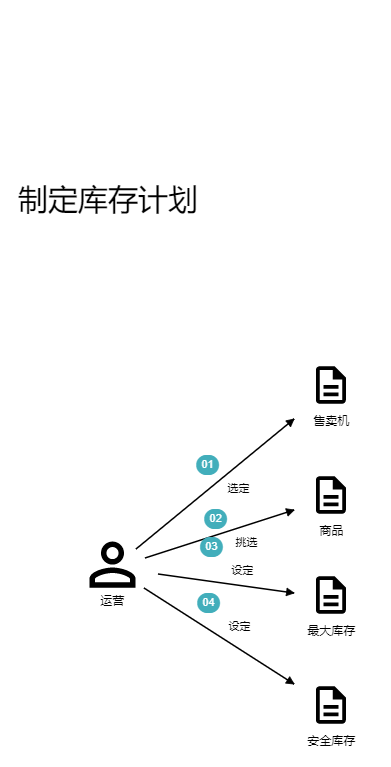
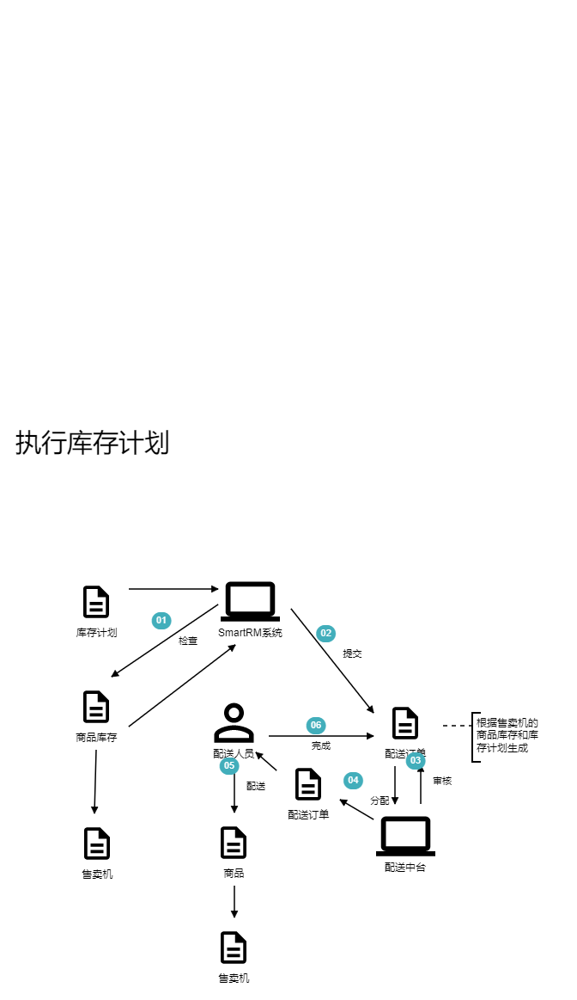
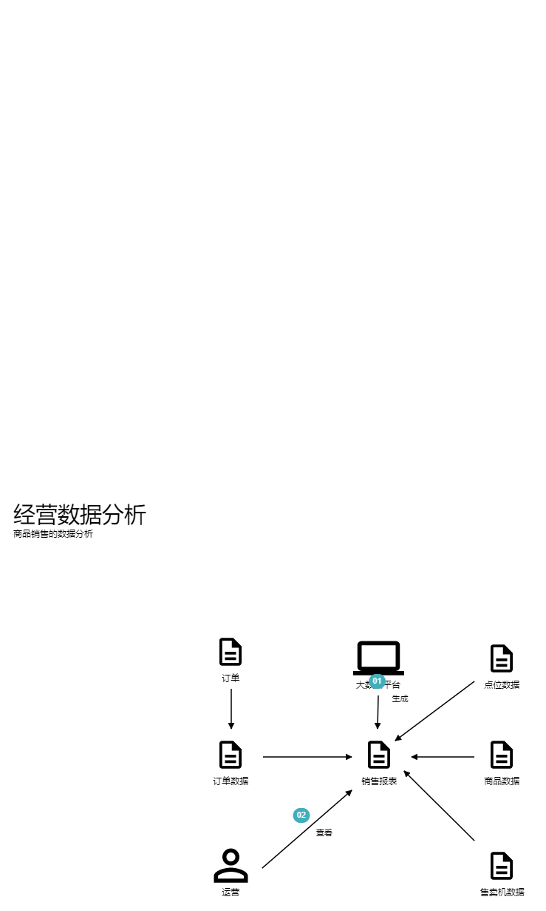

# SmartRM通用语言文档

## 1. 用户故事详细文档

1. ***售卖机扫码支付购物***

   - **卡片**

     作为用户，

     我希望在售卖机上通过手机扫码支付购买商品，

     以便快速便捷地购买商品。

   - **验收标准**

     假设我是一名用户，货道售卖机屏幕的商品列表上有商品A, B, C，

     当我在售卖机屏幕上选择了商品A，并扫描弹出的二维码完成支付后，

     那么商品A就会从售卖机中弹出，我可以拿到商品A。

   - **谈话**

     [Conversation 01](#4.1.1 Conversation 01)

2. ***柜门机免密购物***

   - **卡片**

     作为用户，

     我希望在支持自动结算免密支付的柜门机上扫码开门后拿到商品，关门就可以结束购物，系统后台可以自动结算并且扣费。

     以便在柜门机上能更快捷地进行购物。

   - **验收标准**

     假设我是一名用户，柜门机里有商品A, B, C

     当我打开柜门，从柜门机拿走商品A并且关闭柜门，

     那么后台会自动完成结算和支付，从用户账户扣除商品A的价格，并且锁定柜门。

   - **谈话**

     [Conversation 02](#4.1.2 Conversation 02)

3. ***售卖机投放***

   - **卡片**

     作为运营人员，

     我希望按照我的要求把特定型号的售卖机投放到指定的点位，

     以便通过售卖机销售商品产生利润。

   - **验收标准**

     假设我是一名运营人员，

     当我在系统上指定投放地点和型号并确认投放，

     那么投放申请会发送给企业的ERP系统，在ERP系统的实施流程界面可以看到该申请及其状态。

   - **谈话**

     [Conversation 03](#4.1.3 Conversation 03)

4. ***售卖机撤销***

   - **卡片**

     作为运营人员，

     我希望按照我的要求撤销指定的售卖机，

     以便节约成本，提升整体利润

   - **验收标准**

     假设我是一名运营人员，

     当我在系统中申请撤销指定的售卖机，

     那么系统会发送售卖机撤销申请到企业的ERP系统，在ERP系统的实施流程界面可以看到该申请及其状态。

   - **谈话**

     [Conversation 04](#4.1.4 Conversation 04)

5. ***补货***

   - **卡片**

     作为运营人员，

     我希望按照特定的运营策略，对售卖机中的商品进行及时补充，

     以便售卖机中的商品始终处于可购买状态。

   - **验收标准**

     假设我是一名运营人员，

     当我在系统中提交了售卖机A的库存计划，设定了它的商品B最大库存是X，安全库存是Y，

     那么系统会按照我的库存计划生成配送申请并发送到配送中台系统，售卖机A中的商品B库存低于Y时，第二天配送人员会对售卖机A中的商品B进行补货，使其库存达到X。

   - **谈话**

     [Conversation 05](#4.1.5 Conversation 05)

6. ***经营分析***

   - **卡片**

     作为运营人员，

     我希望能及时查看经营分析报表，

     以便确定和调整运营策略，包括决定和调整库存计划，决定投放和撤销售卖机的等等。

   - **验收标准**

     假设我是一名运营人员

     当我从系统中选择指定查看点位X的销售报表时，

     那么相关界面会弹出，并且通过图表的方式展示该点位的销售指标。

   - **谈话**

     [Conversation 06](#4.1.6 Conversation 06)

## 2. domain storytelling

### 2.1 售卖机扫码支付购物

顶层用户故事的storytelling描述了顶层用户故事的整体框架，但是其中对部分活动的描述并不够，为了更深入的了解领域，我们对这些部分可以进一步展开，进行下一层用户故事的storytelling。例如这里我们对“用户选择商品”（图中01）、“货道售卖机弹出支付二维码”（图中02）两个子用户故事进一步进行了storytelling。

#### 2.1.1 用户选择商品

#### 2.1.2 货道售卖机弹出支付二维码

### 2.2 柜门机免密购物

### 2.3 售卖机投放

### 2.4 售卖机撤销

### 2.5 补货

#### 2.5.1 制定库存计划

#### 2.5.2 执行库存计划

### 2.6 经营分析

## 3. SmartRM通用语言词汇表

| 类型 | 中文         | 英文                    | 上下文                     |
| ---- | ------------ | ----------------------- | -------------------------- |
| 角色 | 用户         | user                    | 用户选择商品               |
| 活动 | 选择         | select                  | 用户选择商品               |
| 对象 | 商品         | sku                     | 用户选择商品               |
| 活动 | 完成         | finish                  | 用户完成支付               |
| 对象 | 支付         | payment                 | 用户完成支付               |
| 对象 | 货道售卖机   | slot vending machine    | 货道售卖机弹出支付二维码   |
| 活动 | 展示         | display                 | 货道售卖机展示支付二维码   |
| 对象 | 支付二维码   | payment QR code         | 货道售卖机弹出支付二维码   |
| 活动 | 弹出         | pop out                 | 货道售卖机弹出商品         |
| 系统 | 手机支付平台 | mobile payment platform | 用户在手机支付平台完成支付 |
| 活动 | 扫描         | scan                    | 用户扫描支付二维码         |
| 对象 | 柜门机二维码 | cabinet QR code         | 用户扫描柜门机二维码       |
| 对象 | 柜门机       | cabinet vending machine | 柜门机解锁柜门             |
| 活动 | 解锁         | unlock                  | 柜门机解锁柜门             |
| 活动 | 锁定         | lock                    | 柜门机锁定柜门             |
| 对象 | 柜门         | cabinet door            | 柜门机锁定柜门             |
| 对象 | 订单         | order                   | 柜门机订单结算             |
| 活动 | 结算         | settle                  | 柜门机订单结算             |
| 活动 | 授权         | authorize               | 用户授权免密支付           |
| 对象 | 免密支付     | password-free payment   | 用户授权免密支付           |
| 活动 | 拿取         | take                    | 用户拿取商品               |
| .... | ....         | ....                    | ....                       |
|      |              |                         |                            |
|      |              |                         |                            |
|      |              |                         |                            |
|      |              |                         |                            |
|      |              |                         |                            |
|      |              |                         |                            |
|      |              |                         |                            |

## 4. 附录

### 4.1 谈话记录

#### 4.1.1 Conversation 01

P: 用户在设备屏幕上选择**商品**后，设备展示**支付二维码**，**用户**使用微信扫描二维码，完成支付后，设备完成出货，**交易**结束，设备屏幕上回到**商品列表**界面。

D: 这里的设备是指**自动售卖机**吗？

P: 是的。

D: 那么我们以后统一用”售卖机“这个词吧？英文用Vending Machine。

P: 没问题。

D: 如果用户支付失败，会怎么样？

P: 售卖机会等待一段时间，然后取消交易，回到商品列表界面。

D: 售卖机出货会失败吗？

P: 有可能，不过我们还是要找懂这套售卖机的人了解下。

D: 是的，我把运营人员O拉进来聊下。

P: O，我们在对SmartRM系统进行建模，想咨询一些售卖机相关的问题。售卖机出货会失败吗？

O：我们应用的售卖机主要包括**自动称重式柜门机**、**弹簧货道售卖机**、**蛇形货道售卖机**。其中，称重式柜门机特点是售卖的商品类型多，不会卡货，主要用于**办公楼**、**商超**、**小区**等室内外公共场所的**饮料**、**零食**、**生鲜**等商品的售卖；弹簧货道售卖机的特点是成本低，售卖商品类型多，卡货概率高，主要用于室内外等公共场所的饮料、零食的售卖；蛇形货道售卖机的特点是体积一般较大、**库存容量**大、卡货概率低、省电，但是只能用于饮料的售卖，主要放在**体育场**、**工厂**、**学校**、**公园**等室内或室外公共场所用于饮料售卖。目前我们有一部分存量弹簧货道售卖机，后面大部分室内的会替换成自动称重柜门机，但是仍然会保留一部分。我们的售卖机可靠性很优秀，但是还是会有几种出货失败的情况。比较常见的出货失败的情况有以下几种：1) 卡货；2) 售卖机网络问题；3) 库存错误

#### 4.1.2 Conversation 02

P：柜门机的购物流程是这样的：

1. 用户扫码，第一次扫码时授权**免密支付**
2. 扫码成功后，柜门解锁
3. 用户打开柜门，拿走想要的商品，关上柜门
4. 售卖机后台触发**结算**，生成**订单**，从用户微信支付**账号**扣取货款

#### 4.1.3 Conversation 03

P：当我们的运营人员发现新的**点位**并与**点位的相关管理人员**达成**初步意向**时，可以在SmartRM系统提交售卖机的**投放申请**。SmartRM会把申请转发到商家的**企业ERP**，接下来会经过**商务沟通**、**合同签订**、**部署安装**等**环节**，在这个流程中，运营人员可以随时查看售卖机投放的**进展**和**状态**。

D: 投放成功后我们应该做什么？

P: **投放成功**后，运营人员可以正常地管理这台售卖机，为它制定补货计划。并且查看它的**运营效率**。

D: 投放有可能失败吗？

P: 一般不会，因为我们的商务人员会提前与点位的控制者达成一致，当然，如果合同签订环节出现无法解决的问题，则法务人员会在ERP中终止流程，此外，合同签订以前，运营人员也可以随时在SmartRM系统中终止或暂停申请。

#### 4.1.4 Conversation 04

P: 当我们发现售卖机无法盈利时，需要把它撤销。

D: 如何确定一台售卖机无法实现盈利呢？

P: 我们从售卖机的经营数据可以看出端倪。但是，现在先让我们把售卖机撤销这件事情的流程讲清楚吧。

P: 当我们决定撤销售卖机时，我们在SmartRM系统提交**撤销申请**，SmartRM系统会提交相应申请到ERP系统，此后，同样会经历商务沟通、**合同解除**、**设备回收**等环节，流程中，运营人员同样可以随时查看售卖机撤销的进展和状态。

D: 撤销成功后，还需要在系统中看到它吗？

P: 不需要了。

D: 撤销有可能失败吗？

P: 不可能。

#### 4.1.5 Conversation 05

P: **库存计划**是最重要的运营策略之一，制定**库存计划**的最终目标是最大化整体**运营利润**，整体运营利润由销售毛利润减去运营成本得到，因此补货计划需要尽量增大**每台售卖机的销售毛利润**，并且尽可能减少**平均单机运营成本**。其中，**单机运营成本**的**配送成本**是可以通过优化**补货频率**、补货路线来降低的。我们的配送人员，每个人会负责固定的一批售卖机，**人员成本**会均摊到每台售卖机，而售卖机的补货频率、补货路线，会影响每个人能够负责的售卖机数量。

D: 所以运营人员制定库存计划的过程是怎么样的？会希望从系统获得哪些帮助呢？

P: 对于新上线的售卖机，运营人员会根据**点位的特征**和**售卖机的型号**，使用**模板**生成库存计划；

P: 对于已有的售卖机，运营人员会查看商品销售报表，调整不同商品的**计划库存比例**，使得不同**商品的补货周期**趋于一致，这样可以使得单台售卖机的补货频率最小化。

P: 当然，最重要的是，我们要确保商品的销售保持在最佳水平，也就是说让每台售卖机销售最热卖的商品。这一点，我们可以从商家现有的**商品中台**获得帮助，商品中台保存了商家现存的所有可销售商品，以及不同**商品的销售数据**、**商品画像**等信息。商品中台提供**公共API**，外部系统可以通过指定**搜索词**、**特征**等参数获取销售最好的商品。当我们发现售卖机现有库存计划中的某个商品销售情况不好时，可以选择新的商品代替它。

D: 运营人员需要分别针对每台售卖机按上述过程操作吗？

P: 事实上，运营人员需要决定的是每台售卖机的库存计划，补货计划最好是能由系统自动生成。而当库存计划偏离上述目标时，系统应该能够提示运营人员进行调整。

#### 4.1.6 Conversation 06

P: 我们会分析决定不同售卖机销售的商品种类和数量，以确定库存计划。

D: 所以我们需要针对每台售卖机从商品池里选择适合销售的商品是吗？

P：是的，我们的目标是选择最优的商品搭配，以使得运营利润最大化。

D：运营利润的定义是什么呢？

P：**运营利润**=毛利润-运营成本；毛利润=**商品销售收入**-**商品进价成本**

D：我们怎么知道一台售卖机的运营成本和毛利润是多少呢？

P：运营成本由很多因素构成，主要包含**售卖机的硬件成本**（折旧均摊到每个月）、点位租金、电费、维修成本等等，我们会从商家的企业ERP系统直接获得每台售卖机的运营成本。**运营收入**目前只包含**商品的销售收入**，我们的系统可以自己根据**订单**数据得到，同时ERP系统里也会根据**财务数据**得到一份，在系统无误的情况下，两边的数据应该是一致的，但是我们也需要每个月进行对账。

